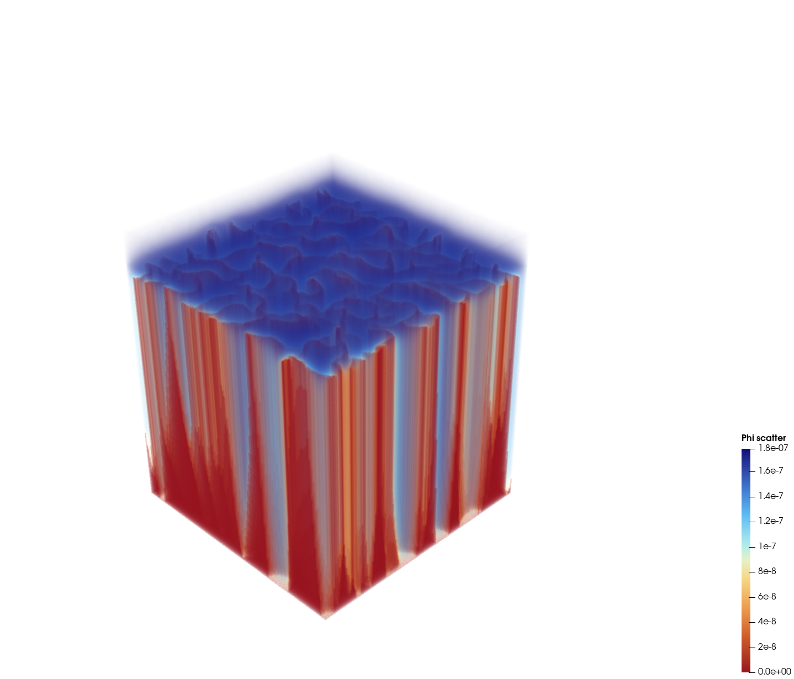
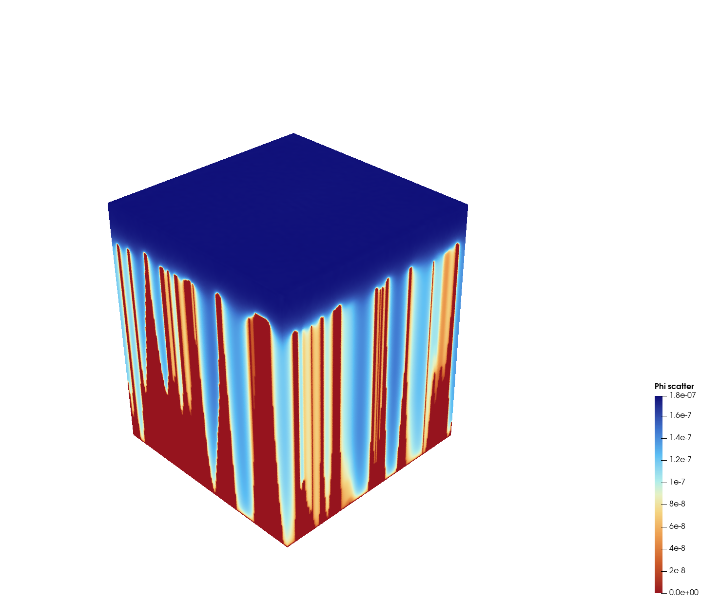

# FETM-NanoWall

[](https://www.python.org/)
[](https://isocpp.org/)
[](scripts/activate_env.sh)
[](data/configs/sample_001.json)
[](https://numpy.org/)
[](https://scipy.org/)
[](https://pytorch.org/)
[](https://vtk.org/)
[](https://www.paraview.org/)

**FETM-NanoWall** is a research pipeline for converting SEM images of graphene
nanowalls into metric nano-domains and geometry-driven first-event transport
fields.

FETM means **First-Event Transport Model**. The project uses
Depth-Anything-3 as a morphology subtool, then applies SEM-specific calibration,
flat-base correction, height scaling, voxelization, ray-based transport, and
ParaView export.

The current target system is:

- graphene nanowalls on an approximately flat substrate
- SEM images with a scale ruler
- known nanowall edge height scale, currently around `1.7 um`
- downstream particle or volume simulation

## Visual Walkthrough

The pipeline starts from the raw SEM image and turns its cropped nanowall
network into a metric surface and voxel transport field.

<p align="center">
  
  
</p>

The left image is the raw SEM input with ruler information; the pipeline
calibrates physical pixel size from this image and then crops the graphene
nanowall domain. The right image is the physically scaled height surface after
inversion, flat-base correction, and edge-height locking near the known `1.7 um`
scale.

Transport is then computed on the voxelized solid/void geometry. The ParaView
snapshots below show three complementary fields on the same nanowall domain:
accessibility, angular visibility, and first-scattering probability. The stored
primary quantity remains the full voxel field `phi_total[z, y, x]`.

<p align="center">
  
  
  
</p>
<p align="center">
  
  
  
</p>

## Process Map

```mermaid
flowchart LR
    A["SEM image with ruler"] --> B["Calibration and crop"]
    B --> C["Depth-Anything-3 relative depth"]
    C --> D["Depth orientation and flat-base bias correction"]
    D --> E["Physical height scaling and edge-height locking"]
    E --> F["Nano physical domain: domain.npz"]
    F --> G["Voxel solid/void domain"]
    G --> H["First-event probabilistic ray transport"]
    H --> I["Voxel fields: phi_total, phi_scatter, phi_surface"]
    I --> J["ParaView VTI/VTK export"]
```



## Repository Layout

```text
FETM/
  nano_sem_domain/          SEM calibration, DA3 bridge, height correction
  nano_transport/           voxelization and transport runner
  transport_cpp/            C++17 DDA ray-tracing kernel
  scripts/                  workflow wrappers and exporters
  docs/assets/              README figures and visual result snapshots
  configs/                  example domain configuration
  data/configs/             sample-specific JSON configs
  data/raw/                 local SEM images
  tools/Depth-Anything-3/   upstream Depth-Anything-3 subtool
  runs/                     generated research outputs
```

## Environment

```bash
python3 -m venv .venv
source scripts/activate_env.sh
pip install -e .
pip install -r requirements-da3-macos.txt
pip install -e tools/Depth-Anything-3 --no-deps
```

Check:

```bash
python scripts/check_env.py
```

On macOS arm64, `xformers` is intentionally omitted. Depth-Anything-3 falls
back to PyTorch implementations. For large production batches, Linux/CUDA is
still the better compute target.

## Data Connection

Use one folder and one config per SEM sample:

```text
data/raw/sample_001/S-5_30k_q38.tif
data/configs/sample_001.json
runs/sample_001/
```

The key config fields are:

- `crop_px`: `[x, y, width, height]` for the graphene domain.
- `calibration.pixel_size_um`: direct physical pixel size, if known.
- `calibration.ruler_line_px`: `[x1, y1, x2, y2]` across the SEM scale bar.
- `calibration.ruler_length_um`: physical scale-bar length.
- `depth.invert_depth`: flips the DA3 depth orientation when nanowalls appear low.
- `bias.surface_method`: `tile` or `polynomial` base-surface correction.
- `height.edge_lock_height_um`: target nanowall edge scale, currently `1.7`.
- `height.edge_lock_negative_tolerance`: allowed negative-only edge variation.

Current sample config:

[data/configs/sample_001.json](data/configs/sample_001.json)

## SEM To Physical Domain

Run Depth-Anything-3 and build the final physical domain:

```bash
sem-to-domain \
  --config data/configs/sample_001.json \
  --image data/raw/sample_001/S-5_30k_q38.tif \
  --out runs/sample_001
```

For development with a saved depth map:

```bash
sem-to-domain \
  --config data/configs/sample_001.json \
  --image data/raw/sample_001/S-5_30k_q38.tif \
  --depth-npy runs/sample_001/raw_depth.npy \
  --out runs/sample_001
```

Main domain artifact:

```text
runs/sample_001/domain.npz
```

It contains:

- `height_um`: final 2D physical height field.
- `base_mask`: flat substrate/base candidate mask.
- `edge_mask`: SEM-bright nanowall edge mask.
- `edge_score`: local edge brightness score.
- `bias_plane`: fitted or tiled substrate bias surface.
- `raw_depth`: raw DA3 or precomputed depth map.
- `pixel_size_um_x`, `pixel_size_um_y`: metric grid spacing.
- `metadata_json`: provenance and config snapshot.

The first visual checkpoint is the cropped SEM image:


The second checkpoint is the metric height field. This preview is generated
after DA3 inference, orientation correction, base locking, and height scaling:


## Physical Formulation

### Scale Calibration

If a manual SEM ruler line is supplied,

$$s_{px} = \frac{L_{\mathrm{um}}}{\sqrt{(x_2-x_1)^2 + (y_2-y_1)^2}}$$

where `s_px` is the source-image pixel size in `um / px`.

After DA3 resizing, output pixel sizes are:

$$\Delta x = s_{px}\frac{W_{\mathrm{crop}}}{W_{\mathrm{depth}}}, \qquad \Delta y = s_{px}\frac{H_{\mathrm{crop}}}{H_{\mathrm{depth}}}$$

### Depth Orientation

Depth-Anything-3 is treated as a relative morphology prior, not a metric SEM
topography measurement:

If `invert_depth` is true:

$$d_o(x,y) = -d(x,y)$$

Otherwise:

$$d_o(x,y) = d(x,y)$$

The oriented depth is shifted by a low percentile:

$$d_s(x,y) = d_o(x,y) - Q_{0.01}(d_o)$$

### Flat-Base Bias Correction

Low regions are used as substrate candidates:

$$B = \{(x,y): d_s(x,y) \le Q_p^{\mathrm{tile}}(d_s)\}$$

A substrate bias surface `b(x,y)` is estimated either by robust polynomial
fitting or tile interpolation. The corrected field is:

$$h_c(x,y) = \max(d_s(x,y) - b(x,y) - f_{\mathrm{base}}(x,y), 0)$$

where `f_base` is the global or tiled base-lock floor.

### Height Scaling

The corrected morphology is mapped to the known nanowall height scale:

$$\alpha = \frac{H_{\mathrm{target}}}{Q_p(h_c : h_c > 0)}$$

$$h_{\mathrm{um}}(x,y) = \alpha h_c(x,y)$$

For the current sample, `H_target = 1.7 um`.

### Edge Height Lock

SEM-bright nanowall edges can be constrained to a maximum band rather than a
constant value. With target height `H` and negative tolerance `tau`,

$$H_{\mathrm{low}} = H(1-\tau)$$

$$h_{\mathrm{edge}}(x,y) = H_{\mathrm{low}} + r(x,y)(H-H_{\mathrm{low}}), \qquad 0 \le r(x,y) \le 1$$

Thus edge values are based on their existing pixel values, capped by `H`, and
allowed to vary only downward.

For the current final run:

```text
H = 1.7 um
tau = 0.05
edge band = [1.615, 1.7] um
```

The resulting surface can be checked interactively through
`runs/sample_001/visualization_3d/surface_3d.html`, or as a static preview:


## Voxel Domain

`xy_stride` controls x/y downsampling before transport.

- `xy_stride = 1`: original cropped domain resolution.
- `xy_stride = 4`: 4 px block-max downsampling.
- `xy_stride = 8`: coarser block-max downsampling.

For stride `k`, the transport grid spacing is:

$$\Delta = k \Delta x$$

The downsampled height uses block maxima:

$$h_k(I,J) = \max_{(x,y)\in \mathrm{block}(I,J)} h_{\mathrm{um}}(x,y)$$

Voxel centers are:

$$z_l = \left(l + \frac{1}{2}\right)\Delta$$

The solid mask is:

Solid voxels are assigned by:

$$\Omega_s(l,J,I) = 1 \quad \mathrm{if} \quad z_l \le h_k(I,J)$$

and otherwise:

$$\Omega_s(l,J,I) = 0$$

The void region is:

$$\Omega_v = \Omega \setminus \Omega_s$$

In arrays:

```text
true  -> solid
false -> void
```

## First-Event Transport Model

Transport is not solved as a diffusion PDE. It is computed from free-flight
survival, first scattering probability, and ray-surface interactions.

### Uniform Void Source

Every void voxel receives equal source mass:

$$\phi_{\mathrm{in}}(x_i) = \frac{1}{|\Omega_v|}, \qquad x_i \in \Omega_v$$

### Free-Flight Survival

$$P_{\mathrm{survive}}(d) = \exp\left(-\frac{d}{\lambda}\right)$$

### First Scattering Density

$$p(s) = \frac{1}{\lambda}\exp\left(-\frac{s}{\lambda}\right)$$

### Probability Decomposition

For a path of length `d`:

$$\int_0^d \frac{1}{\lambda}\exp\left(-\frac{s}{\lambda}\right)\,ds + \exp\left(-\frac{d}{\lambda}\right) = 1$$

This decomposes probability into:

- scattering within the void volume
- direct surface arrival
- optional lost mass when the ray reaches the truncation distance

### Direction Sampling

Directions are sampled with a Fibonacci sphere:

$$z_m = 1 - \frac{2(m+0.5)}{N}$$

$$\theta_m = m\pi(3-\sqrt{5})$$

$$v_m = \bigl(\cos\theta_m\sqrt{1-z_m^2}, \; \sin\theta_m\sqrt{1-z_m^2}, \; z_m\bigr)$$

with equal directional weight:

$$w_m = \frac{1}{N}$$

### DDA Ray Accumulation

For each ray segment `[s_a, s_b]` inside a voxel:

$$\Delta F = \exp\left(-\frac{s_a}{\lambda}\right) - \exp\left(-\frac{s_b}{\lambda}\right)$$

The spatial scattering field accumulates:

$$\phi_{\mathrm{scatter}}(x) \leftarrow \phi_{\mathrm{scatter}}(x) + \phi_{\mathrm{in}}(x_i) w_m \Delta F$$

If a solid surface is reached at distance `d`:

$$\phi_{\mathrm{surface}}(x_s) \leftarrow \phi_{\mathrm{surface}}(x_s) + \phi_{\mathrm{in}}(x_i) w_m \exp\left(-\frac{d}{\lambda}\right)$$

The primary field used for analysis is:

$$\phi_{\mathrm{total}}(x) = \phi_{\mathrm{scatter}}(x) + \phi_{\mathrm{surface}}(x)$$

This is a **voxelwise total accumulated probability mass**, not a directional
projection and not a z-projection.

### Box Reflection

When enabled, rays reflect specularly from the computational box:

$$v' = v - 2(v\cdot n)n$$

For axis-aligned boundaries this flips the corresponding component:

$$v_x'=-v_x, \qquad v_y'=-v_y, \qquad v_z'=-v_z$$

### Probability Check

The kernel reports:

$$\sum_x \phi_{\mathrm{scatter}}(x) + \sum_x \phi_{\mathrm{surface}}(x) + M_{\mathrm{escape}} + M_{\mathrm{lost}} \approx 1$$

## Run Transport And ParaView Export

Use the case wrapper when changing stride or direction count:

```bash
.venv/bin/python scripts/run_transport_case.py --xy-stride 4 --n-dir 256
```

Another run:

```bash
.venv/bin/python scripts/run_transport_case.py --xy-stride 6 --n-dir 192
```

The output folder is generated automatically:

```text
runs/sample_001/transport_lambda_0p10_stride<STRIDE>_dir<N_DIR>/
```

Each run writes:

```text
transport_fields.npz
metadata.json
paraview/transport_fields.vti
paraview/domain_height_surface.vtk
paraview/domain_solid_voxel_surface.vtk
paraview/paraview_export_metadata.json
```

ParaView snapshots are useful for comparing complementary transport fields:

<p align="center">
  
  
  
</p>
<p align="center">
  
  
  
</p>

The exact 3D result should be inspected in ParaView from:

```text
paraview/transport_fields.vti
paraview/domain_height_surface.vtk
paraview/domain_solid_voxel_surface.vtk
```

If the exact voxel surface mesh is too heavy:

```bash
.venv/bin/python scripts/run_transport_case.py \
  --xy-stride 4 \
  --n-dir 256 \
  --skip-paraview-voxel-mesh
```

Intermediate C++ kernel buffers are removed by default after `npz` and ParaView
files are written. Keep them only when debugging:

```bash
.venv/bin/python scripts/run_transport_case.py \
  --xy-stride 4 \
  --n-dir 256 \
  --keep-kernel-buffers
```

## Current Final Outputs

The current cleaned result set is documented here:

[runs/sample_001/FINAL_OUTPUTS.md](runs/sample_001/FINAL_OUTPUTS.md)

Core files:

```text
runs/sample_001/domain.npz
runs/sample_001/height_um.npy
runs/sample_001/transport_lambda_0p10_stride4_dir256/transport_fields.npz
runs/sample_001/transport_lambda_0p10_stride4_dir256/paraview/transport_fields.vti
runs/sample_001/transport_lambda_0p10_stride4_dir256/paraview/domain_height_surface.vtk
runs/sample_001/transport_lambda_0p10_stride4_dir256/paraview/domain_solid_voxel_surface.vtk
```

Current final transport run:

```text
xy_stride = 4
n_dir = 256
lambda = 0.10 um
grid = 217 x 189 x 189
primary field = phi_total[z, y, x]
```

## README Figure Generation

The visual figures in this README are stored in:

```text
docs/assets/
```

Regenerate them from the current `runs/sample_001` outputs with:

```bash
.venv/bin/python scripts/build_readme_figures.py
```

## Output Field Contract

`transport_fields.npz` contains:

- `phi_total`: voxelwise total accumulated probability mass.
- `phi_scatter`: first-scattering probability accumulated in each voxel.
- `phi_surface`: direct surface-arrival probability accumulated at solid voxels.
- `accessibility`: average direct arrival survival over hit directions.
- `vis_ang`: fraction of directions that hit a solid surface.
- `d_min_um`: minimum hit distance in `um`.
- `mask_solid`: boolean solid/void voxel domain.
- `metadata_json`: run metadata and probability diagnostics.

ParaView fields in `transport_fields.vti` use cell data with array layout:

```text
[z, y, x]
```

ParaView coordinates are in `um`.

## Language And Tool Roles

| Layer | Language / Tool | Role |
| --- | --- | --- |
| SEM pipeline | Python | image IO, calibration, DA3 bridge, height correction |
| Morphology prior | PyTorch / Depth-Anything-3 | relative depth inference |
| Numerical processing | NumPy / SciPy | masks, interpolation, robust correction |
| Transport kernel | C++17 | multithreaded DDA ray traversal |
| Workflow wrappers | Python / shell | repeatable local runs |
| Config | JSON | sample-specific parameters |
| Visualization export | VTK / ParaView | volume fields and domain meshes |

## Research Notes

- Monocular depth from SEM is not metric topography by itself. This project uses
  DA3 as a morphology prior and imposes physical scale from SEM calibration and
  known nanowall height.
- The flat substrate assumption is central: low/minimum regions are treated as
  exposed base and used to remove DA3-induced slope or drift.
- The edge height lock reflects the experimental assumption that visible
  nanowall edges are near the known height scale.
- The transport model is geometry-driven and non-local. Diffusion is not
  assumed, but may appear as a limiting behavior under appropriate scattering
  regimes.
- Check upstream Depth-Anything-3 and model-card licenses before publication or
  redistribution.
