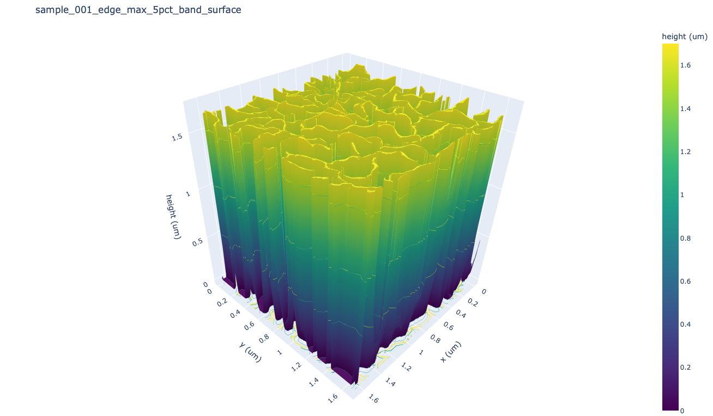
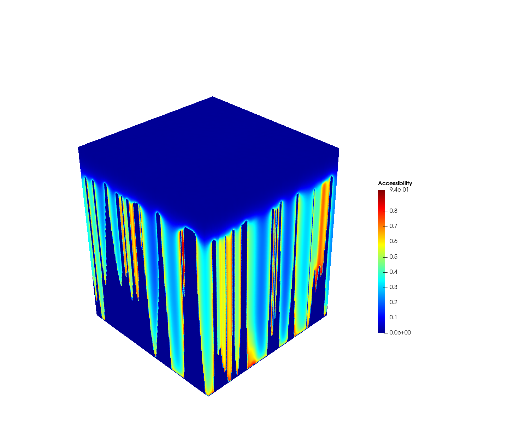
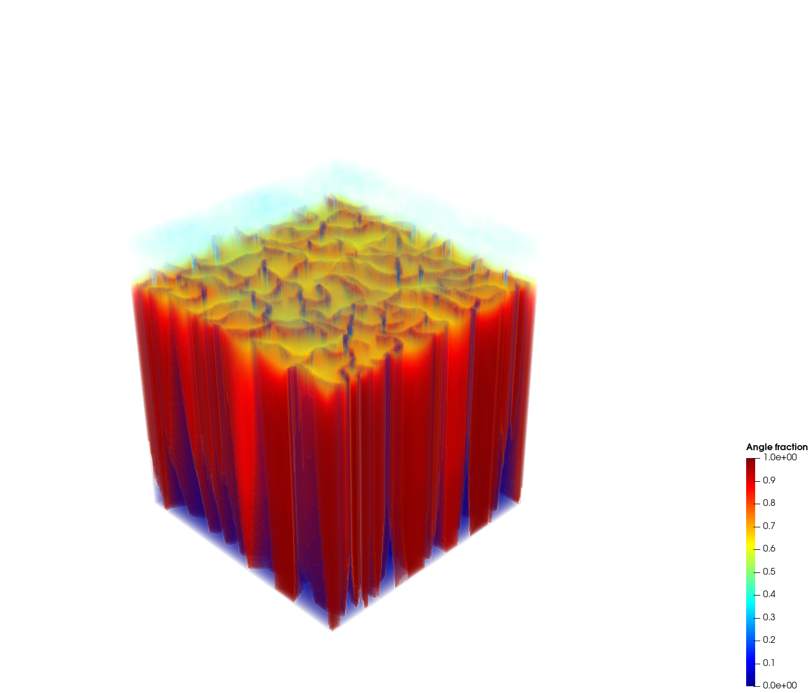
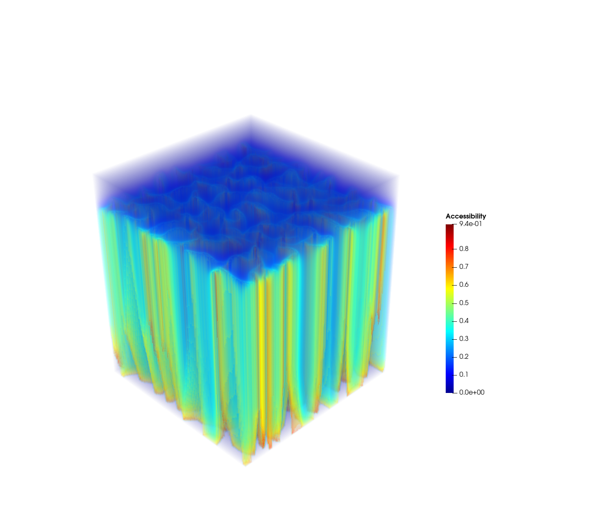
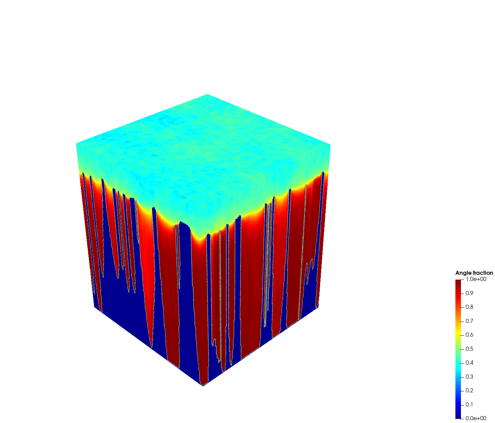
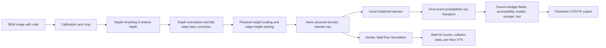
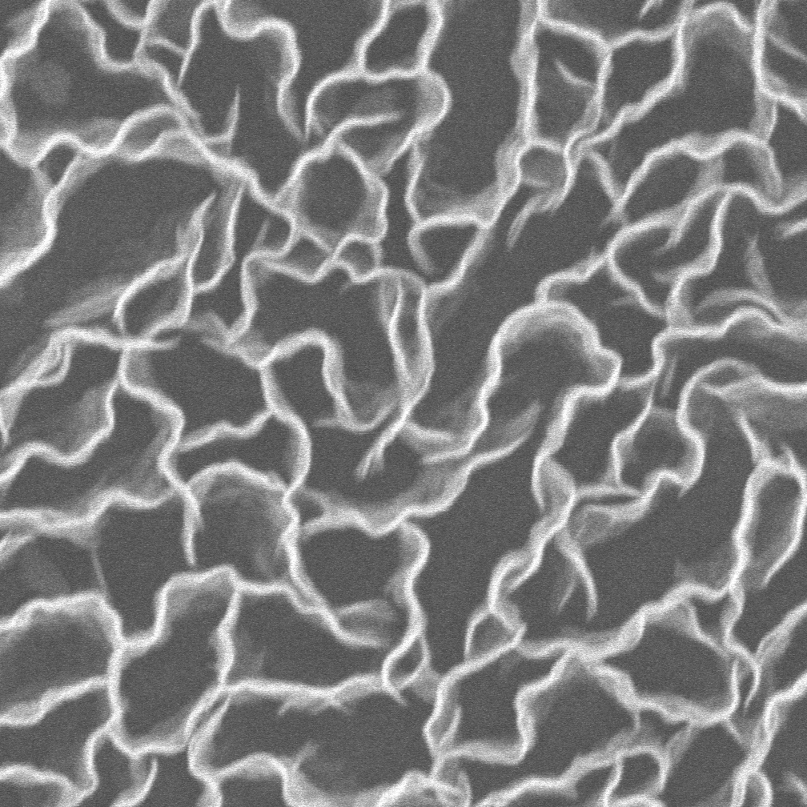
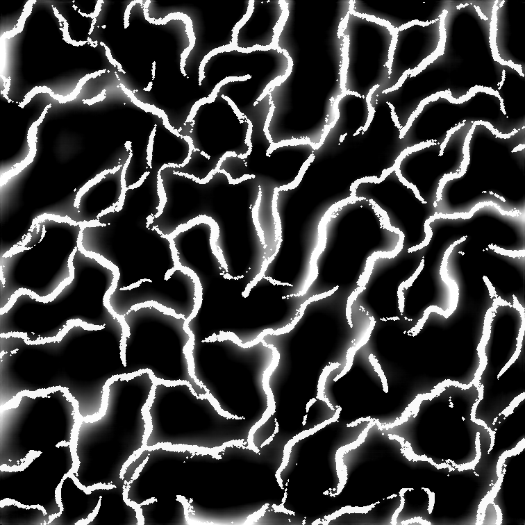
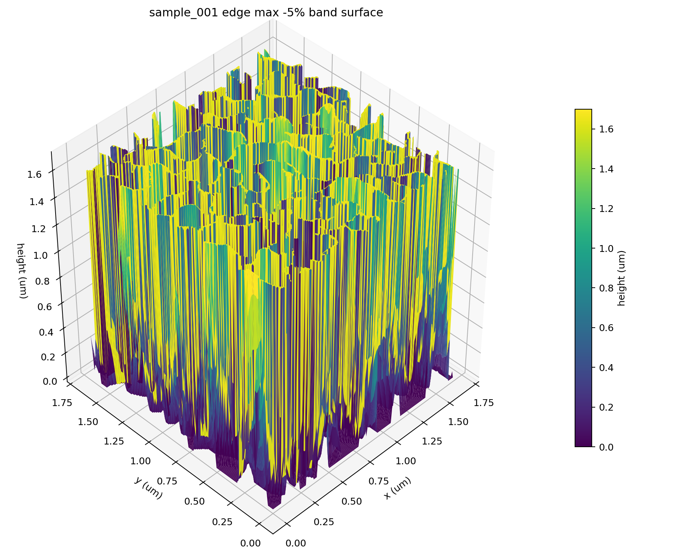

# FETM-NanoWall

[](https://www.python.org/)
[](https://isocpp.org/)
[](scripts/activate_env.sh)
[](data/configs/sample_001.json)
[](https://numpy.org/)
[](https://scipy.org/)
[](https://pytorch.org/)
[](https://vtk.org/)
[](https://www.paraview.org/)

**FETM-NanoWall** is a research pipeline for converting SEM images of graphene
nanowalls into metric nano-domains and geometry-driven first-event transport
fields.

FETM means **First-Event Transport Model**. The project uses
Depth-Anything-3 as a morphology subtool, then applies SEM-specific calibration,
flat-base correction, height scaling, voxelization, ray-based transport, and
ParaView export. A separate particle trajectory module, called **Kinetic
Wall-Flux Simulation (KWFS)**, uses the same voxelized solid/void nanowall
domain to estimate wall collision counts and collision rates.

The current target system is:

- graphene nanowalls on an approximately flat substrate
- SEM images with a scale ruler
- known nanowall edge height scale, currently around `1.7 um`
- downstream particle or volume simulation

## Visual Walkthrough

The pipeline starts from the raw SEM image and turns its cropped nanowall
network into a metric surface and voxel transport field.

<p align="center">
  
  
</p>

The left image is the raw SEM input with ruler information; the pipeline
calibrates physical pixel size from this image and then crops the graphene
nanowall domain. The right image is the physically scaled height surface after
inversion, flat-base correction, and edge-height locking near the known `1.7 um`
scale.

Transport is then computed on the voxelized solid/void geometry. The ParaView
snapshots below show source-voxel fields on the same nanowall domain:
accessibility and angular visibility. The stored primary quantity is now the
source-side budget, where each void source voxel satisfies
`source_scatter_fraction + accessibility + source_escape_fraction + source_lost_fraction ~= 1`.

<p align="center">
  
  
</p>
<p align="center">
  
  
</p>

## Process Map



## Repository Layout

```text
FETM/
  nano_sem_domain/          SEM calibration, DA3 bridge, height correction
  nano_transport/           voxelization, transport runner, KWFS wrapper
  transport_cpp/            C++17 ray and particle wall-flux kernels
  scripts/                  workflow wrappers and exporters
  docs/assets/              README figures and visual result snapshots
  configs/                  example domain configuration
  data/configs/             sample-specific JSON configs
  data/raw/                 local SEM images
  tools/Depth-Anything-3/   upstream Depth-Anything-3 subtool
  runs/                     generated research outputs
```

## Environment

```bash
python3 -m venv .venv
source scripts/activate_env.sh
pip install -e .
pip install -r requirements-da3-macos.txt
pip install -e tools/Depth-Anything-3 --no-deps
```

Check:

```bash
python scripts/check_env.py
```

On macOS arm64, `xformers` is intentionally omitted. Depth-Anything-3 falls
back to PyTorch implementations. For large production batches, Linux/CUDA is
still the better compute target.

## Data Connection

Use one folder and one config per SEM sample:

```text
data/raw/sample_001/S-5_30k_q38.tif
data/configs/sample_001.json
runs/sample_001/
```

The key config fields are:

- `crop_px`: `[x, y, width, height]` for the graphene domain.
- `calibration.pixel_size_um`: direct physical pixel size, if known.
- `calibration.ruler_line_px`: `[x1, y1, x2, y2]` across the SEM scale bar.
- `calibration.ruler_length_um`: physical scale-bar length.
- `depth.invert_depth`: flips the DA3 depth orientation when nanowalls appear low.
- `bias.surface_method`: `tile` or `polynomial` base-surface correction.
- `height.edge_lock_height_um`: target nanowall edge scale, currently `1.7`.
- `height.edge_lock_negative_tolerance`: allowed negative-only edge variation.

Current sample config:

[data/configs/sample_001.json](data/configs/sample_001.json)

## SEM To Physical Domain

Run Depth-Anything-3 and build the final physical domain:

```bash
sem-to-domain \
  --config data/configs/sample_001.json \
  --image data/raw/sample_001/S-5_30k_q38.tif \
  --out runs/sample_001
```

For development with a saved depth map:

```bash
sem-to-domain \
  --config data/configs/sample_001.json \
  --image data/raw/sample_001/S-5_30k_q38.tif \
  --depth-npy runs/sample_001/raw_depth.npy \
  --out runs/sample_001
```

Main domain artifact:

```text
runs/sample_001/domain.npz
```

It contains:

- `height_um`: final 2D physical height field.
- `base_mask`: flat substrate/base candidate mask.
- `edge_mask`: SEM-bright nanowall edge mask.
- `edge_score`: local edge brightness score.
- `bias_plane`: fitted or tiled substrate bias surface.
- `raw_depth`: raw DA3 or precomputed depth map.
- `pixel_size_um_x`, `pixel_size_um_y`: metric grid spacing.
- `metadata_json`: provenance and config snapshot.

The first visual checkpoint is the cropped SEM image:



The second checkpoint is the metric height field. This preview is generated
after DA3 inference, orientation correction, base locking, and height scaling:



## Physical Formulation

### Scale Calibration

If a manual SEM ruler line is supplied,

$$s_{px} = \frac{L_{\mathrm{um}}}{\sqrt{(x_2-x_1)^2 + (y_2-y_1)^2}}$$

where `s_px` is the source-image pixel size in `um / px`.

After DA3 resizing, output pixel sizes are:

$$\Delta x = s_{px}\frac{W_{\mathrm{crop}}}{W_{\mathrm{depth}}}, \qquad \Delta y = s_{px}\frac{H_{\mathrm{crop}}}{H_{\mathrm{depth}}}$$

### Depth Orientation

Depth-Anything-3 is treated as a relative morphology prior, not a metric SEM
topography measurement:

If `invert_depth` is true:

$$d_o(x,y) = -d(x,y)$$

Otherwise:

$$d_o(x,y) = d(x,y)$$

The oriented depth is shifted by a low percentile:

$$d_s(x,y) = d_o(x,y) - Q_{0.01}(d_o)$$

### Flat-Base Bias Correction

Low regions are used as substrate candidates:

$$B = \{(x,y): d_s(x,y) \le Q_p^{\mathrm{tile}}(d_s)\}$$

A substrate bias surface `b(x,y)` is estimated either by robust polynomial
fitting or tile interpolation. The corrected field is:

$$h_c(x,y) = \max(d_s(x,y) - b(x,y) - f_{\mathrm{base}}(x,y), 0)$$

where `f_base` is the global or tiled base-lock floor.

### Height Scaling

The corrected morphology is mapped to the known nanowall height scale:

$$\alpha = \frac{H_{\mathrm{target}}}{Q_p(h_c : h_c > 0)}$$

$$h_{\mathrm{um}}(x,y) = \alpha h_c(x,y)$$

For the current sample, `H_target = 1.7 um`.

### Edge Height Lock

SEM-bright nanowall edges can be constrained to a maximum band rather than a
constant value. With target height `H` and negative tolerance `tau`,

$$H_{\mathrm{low}} = H(1-\tau)$$

$$h_{\mathrm{edge}}(x,y) = H_{\mathrm{low}} + r(x,y)(H-H_{\mathrm{low}}), \qquad 0 \le r(x,y) \le 1$$

Thus edge values are based on their existing pixel values, capped by `H`, and
allowed to vary only downward.

For the current final run:

```text
H = 1.7 um
tau = 0.05
edge band = [1.615, 1.7] um
```

The resulting surface can be checked interactively through
`runs/sample_001/visualization_3d/surface_3d.html`, or as a static preview:



## Voxel Domain

`xy_stride` controls x/y downsampling before transport.

- `xy_stride = 1`: original cropped domain resolution.
- `xy_stride = 4`: 4 px block-max downsampling.
- `xy_stride = 8`: coarser block-max downsampling.

For stride `k`, the transport grid spacing is:

$$\Delta = k \Delta x$$

The downsampled height uses block maxima:

$$h_k(I,J) = \max_{(x,y)\in \mathrm{block}(I,J)} h_{\mathrm{um}}(x,y)$$

Voxel centers are:

$$z_l = \left(l + \frac{1}{2}\right)\Delta$$

The solid mask is:

Solid voxels are assigned by:

$$\Omega_s(l,J,I) = 1 \quad \mathrm{if} \quad z_l \le h_k(I,J)$$

and otherwise:

$$\Omega_s(l,J,I) = 0$$

The void region is:

$$\Omega_v = \Omega \setminus \Omega_s$$

In arrays:

```text
true  -> solid
false -> void
```

## First-Event Transport Model

Transport is not solved as a diffusion PDE. It is computed from free-flight
survival, first scattering probability, and ray-surface interactions.

### Uniform Void Source

Every void voxel receives equal source mass:

$$\phi_{\mathrm{in}}(x_i) = \frac{1}{|\Omega_v|}, \qquad x_i \in \Omega_v$$

### Free-Flight Survival

$$P_{\mathrm{survive}}(d) = \exp\left(-\frac{d}{\lambda}\right)$$

### First Scattering Density

$$p(s) = \frac{1}{\lambda}\exp\left(-\frac{s}{\lambda}\right)$$

### Probability Decomposition

For a path of length `d`:

$$\int_0^d \frac{1}{\lambda}\exp\left(-\frac{s}{\lambda}\right)\,ds + \exp\left(-\frac{d}{\lambda}\right) = 1$$

This decomposes probability into:

- scattering within the void volume
- direct surface arrival
- optional lost mass when the ray reaches the truncation distance

### Direction Sampling

Directions are sampled with a Fibonacci sphere:

$$z_m = 1 - \frac{2(m+0.5)}{N}$$

$$\theta_m = m\pi(3-\sqrt{5})$$

$$v_m = \bigl(\cos\theta_m\sqrt{1-z_m^2}, \; \sin\theta_m\sqrt{1-z_m^2}, \; z_m\bigr)$$

with equal directional weight:

$$w_m = \frac{1}{N}$$

### DDA Source-Budget Accumulation

For each ray segment `[s_a, s_b]` inside a voxel:

$$\Delta F = \exp\left(-\frac{s_a}{\lambda}\right) - \exp\left(-\frac{s_b}{\lambda}\right)$$

The source voxel accumulates this segment probability as its first-scattering
fraction:

$$B_{\mathrm{scatter}}(x_i) \leftarrow B_{\mathrm{scatter}}(x_i) + w_m \Delta F$$

If a solid surface is reached at distance `d`:

$$A(x_i) \leftarrow A(x_i) + w_m \exp\left(-\frac{d}{\lambda}\right)$$

If a ray escapes the box or is truncated at the maximum ray length, the
surviving residual probability is stored in `source_escape_fraction` or
`source_lost_fraction`.

For each source voxel `x_i`, the per-source fractions are:

$$B_{\mathrm{scatter}}(x_i) + A(x_i) + B_{\mathrm{escape}}(x_i) + B_{\mathrm{lost}}(x_i) \approx 1$$

The current pipeline stores this source-side budget directly and no longer
exports destination-side probability-deposition fields.

### Box Reflection

When enabled, rays reflect specularly from the computational box:

$$v' = v - 2(v\cdot n)n$$

For axis-aligned boundaries this flips the corresponding component:

$$v_x'=-v_x, \qquad v_y'=-v_y, \qquad v_z'=-v_z$$

### Probability Check

The kernel reports:

$$B_{\mathrm{scatter}}(x_i) + A(x_i) + B_{\mathrm{escape}}(x_i) + B_{\mathrm{lost}}(x_i) \approx 1 \qquad \forall x_i \in \Omega_v$$

## Run Transport And ParaView Export

Use the case wrapper when changing stride or direction count:

```bash
.venv/bin/python scripts/run_transport_case.py --xy-stride 4 --n-dir 256
```

Another run:

```bash
.venv/bin/python scripts/run_transport_case.py --xy-stride 6 --n-dir 192
```

The output folder is generated automatically:

```text
runs/sample_001/transport_lambda_0p10_stride<STRIDE>_dir<N_DIR>/
```

Each run writes:

```text
transport_fields.npz
metadata.json
transport_metrics.json
paraview/transport_fields.vti
paraview/domain_height_surface.vtk
paraview/domain_solid_voxel_surface.vtk
paraview/paraview_export_metadata.json
```

`transport_fields.npz` and the ParaView VTI include
`kinetic_contact_rate_s_inv` by default. The default mean molecular speed used
for this derived KCR field is `370353425.4688162 um/s`; override it with
`--v-mean-um-s` if the gas model changes.

`domain_height_surface.vtk` depends only on `domain.npz` and `xy_stride`, not on
MFP. The case wrapper caches it once at:

```text
runs/sample_001/domain_height_stride<STRIDE>/domain_height_surface.vtk
```

and links that cached mesh into each case folder. Use `--no-reuse-height-mesh`
only when an independent copy is needed. `domain_solid_voxel_surface.vtk` is
optional and is usually skipped for stride-2 runs because it is much larger.

`metadata.json` stores run parameters and probability-conservation sums.
`transport_metrics.json` stores scalar summaries from the 3D fields, including
raw probability integrals, volume-weighted integrals, projected-area-normalized
integrals, void/solid means, percentiles, geometry volumes, and probability
balance. For thin-film-style comparison, `areal_integral_um` is defined as
`sum(field * voxel_volume_um3) / projected_area_um2`.

ParaView snapshots are useful for comparing complementary transport fields:

<p align="center">
  
  
</p>
<p align="center">
  
  
</p>

The exact 3D result should be inspected in ParaView from:

```text
paraview/transport_fields.vti
paraview/domain_height_surface.vtk
paraview/domain_solid_voxel_surface.vtk
```

## Kinetic Wall-Flux Simulation

**Kinetic Wall-Flux Simulation (KWFS)** is the particle-trajectory counterpart
to the first-event accessibility field. It runs explicit gas-particle
trajectories over the same voxelized solid/void domain and records wall impact
counts on exposed voxel faces. The triangle-mesh particle path is kept only as a
diagnostic path because it produced artificial high-`z` hit spikes on this
height-field domain.

The model keeps the following physics from the original MATLAB-style particle
transport setup:

- Maxwellian velocity initialization with gas temperature and molecular mass.
- Mean free path from pressure:

$$
\lambda =
\frac{k_B T}{\sqrt{2}\pi d^2 P}
$$

- Background gas scattering as an exponential free-flight timer.
- Voxel-DDA wall collision detection on the same solid/void grid used by the
  first-event accessibility calculation.
- Lambertian wall reflection after a wall hit.
- Per-face wall hit counts, total collision rate, and area-averaged collision
  rate.

The current pressure-sweep values used for the MFP cases are:

| `lambda_um` | Pressure (`kPa`) | Pressure (`atm`) |
| ---: | ---: | ---: |
| `0.01` | `676.4 kPa` | `6.68 atm` |
| `0.05` | `135.3 kPa` | `1.34 atm` |
| `0.10` | `67.6 kPa` | `0.668 atm` |
| `0.20` | `33.8 kPa` | `0.334 atm` |

`ppm` controls the particle count through the gas molar volume `RT/P`, so at a
fixed `ppm` lower pressure produces fewer simulated particles.

### KWFS Boundary And Initial Conditions

KWFS supports two initial/restart position modes:

- `uniform`: volume-uniform sampling over all void voxels.
- `top`: volume-uniform sampling over void voxels with `z >= wall_height_um`.

For both modes, particle positions are sampled uniformly inside selected void
voxels.

Outer box boundaries are open reservoir boundaries:

- Side escape reinjects at the corresponding side boundary.
- Top escape reinjects near `z = z_max`.
- Reinjected particles receive a random Maxwellian velocity and a new background
  scattering timer, matching the original MATLAB particle loop.

Wall collisions are counted on exposed voxel faces. After a hit, the particle is
nudged back to the gas-side voxel face and the outgoing velocity is sampled from
a Lambertian distribution about that face normal. KWFS reports total escapes,
stuck resets, and background scattering counts so escape- or reset-dominated
runs can be rejected before interpretation.

### Running A KWFS Pressure Sweep

Example corrected full-resolution sweep:

```bash
python3 scripts/run_fullres_pressure_sweep_10us.py \
  --out-root runs/sample_001/kwfs_voxel_pressure_sweep_50ppm_5us \
  --ppm 50e-6 \
  --total-time-s 5e-6 \
  --write-vtk
```

Each case writes:

```text
particle_hits_summary.json
hit_curve.csv
face_hits.u64
wall_hit_count.vtk
```

Use `--write-vtk` for ParaView output. Without it, the compact binary
`face_hits.u64` is still written for reporting and post-processing.

### Knudsen / Accessibility / Collision Comparison

For comparing KWFS collision rates against the first-event field, the
characteristic length is taken as:

$$
L_c = \frac{4V_{\mathrm{void}}}{A_{\mathrm{wall}}}
$$

and:

$$
Kn = \frac{\lambda}{L_c}
$$

The comparison script joins:

- `Kn`
- areal accessibility, `void_accessibility_areal_integral_um`
- void-mean Kinetic Contact Rate, `void_mean_kinetic_contact_rate_s_inv`
- void-mean KCR contact time, `void_kinetic_contact_time_ns`
- finite-window contact probabilities, `void_contact_probability_0p1ns` and
  `void_contact_probability_1ns`
- per-particle collision rate, `collision_rate_s_inv / n_particle`

The particle result is normalized per simulated particle:

$$
R_{\mathrm{KWFS}}
=
\frac{N_{\mathrm{wall\,hits}}}
{N_{\mathrm{particle}}\,T_{\mathrm{counted}}}
$$

where `T_counted = (steps - warmup_steps) dt`. This gives units of `s^-1`.

The KCR comparison value is the void-source mean:

$$
\langle \mathrm{KCR}\rangle_{\Omega_v}
=
\frac{1}{V_{\mathrm{void}}}
\int_{\Omega_{\mathrm{void}}}
A(\mathbf{x};\lambda)\frac{\bar{v}}{\lambda}
\,dV
$$

Only void voxels are included because gas particles do not occupy solid voxels.
This quantity has the same unit as `R_KWFS`, but it is a source-field estimate,
not a trajectory count.

Run:

```bash
python3 scripts/plot_knudsen_accessibility_collision.py \
  --sweep-dir runs/sample_001/kwfs_voxel_pressure_sweep_50ppm_5us
```

Outputs:

```text
knudsen_accessibility_collision.csv
knudsen_accessibility_collision.png
knudsen_kcr_collision.png
```

The reconstructed height surface can also be exported with the aligned SEM crop
as a texture:

```bash
.venv/bin/python scripts/export_textured_height_mesh.py \
  --domain runs/sample_001/domain.npz \
  --texture runs/sample_001/cropped_input.png \
  --out-dir runs/sample_001/textured_height_stride2 \
  --stride 2
```

This writes `domain_height_sem_textured.obj`, `domain_height_sem_textured.mtl`,
`domain_height_sem_textured.vtk`, and `sem_texture.png`. Open the OBJ in a mesh
viewer, or open the VTK surface in ParaView and apply `sem_texture.png` as the
texture if it is not attached automatically.

If the exact voxel surface mesh is too heavy:

```bash
.venv/bin/python scripts/run_transport_case.py \
  --xy-stride 4 \
  --n-dir 256 \
  --skip-paraview-voxel-mesh
```

Intermediate C++ kernel buffers are removed by default after `npz` and ParaView
files are written. Keep them only when debugging:

```bash
.venv/bin/python scripts/run_transport_case.py \
  --xy-stride 4 \
  --n-dir 256 \
  --keep-kernel-buffers
```

## Current Final Outputs

The current cleaned result set is documented here:

[runs/sample_001/FINAL_OUTPUTS.md](runs/sample_001/FINAL_OUTPUTS.md)

Core files:

```text
runs/sample_001/domain.npz
runs/sample_001/height_um.npy
runs/sample_001/transport_lambda_0p10_stride4_dir256/transport_fields.npz
runs/sample_001/transport_lambda_0p10_stride4_dir256/paraview/transport_fields.vti
runs/sample_001/transport_lambda_0p10_stride4_dir256/paraview/domain_height_surface.vtk
runs/sample_001/transport_lambda_0p10_stride4_dir256/paraview/domain_solid_voxel_surface.vtk
```

Current final transport run:

```text
xy_stride = 4
n_dir = 256
lambda = 0.10 um
grid = 217 x 189 x 189
primary field = accessibility[z, y, x]
```

## README Figure Generation

The visual figures in this README are stored in:

```text
docs/assets/
```

Regenerate them from the current `runs/sample_001` outputs with:

```bash
.venv/bin/python scripts/build_readme_figures.py
```

## Output Field Contract

`transport_fields.npz` contains:

- `accessibility`: source-voxel accessibility based on surviving direct flights to a wall.
- `kinetic_contact_rate_s_inv`: Kinetic Contact Rate, `accessibility * v_mean / lambda`.
- `vis_ang`: source-voxel angular visibility, shown as `Angle fraction` in ParaView snapshots.
- `d_min_um`: source-voxel minimum wall-hit distance in `um`.
- `source_scatter_fraction`: per-source probability fraction whose first event is scattering.
- `source_escape_fraction`: per-source residual probability escaping the box.
- `source_lost_fraction`: per-source residual probability left after ray truncation.
- `source_probability_sum`: per-source sum of scatter, surface, escape, and lost fractions.
- `source_conservation_error`: `abs(source_probability_sum - 1)` for each source voxel.
- `mask_solid`: boolean solid/void voxel domain.
- `metadata_json`: run metadata and probability diagnostics.

### Field Interpretation

All transport outputs are now source-diagnostic fields: they describe what
happens to probability launched from each void voxel.

| Field | Stored on | Meaning |
| --- | --- | --- |
| `accessibility` | void source cells | Direction-averaged direct-arrival survival probability. |
| `kinetic_contact_rate_s_inv` | void source cells | Kinetic Contact Rate, `accessibility * v_mean / lambda`; a rate field in `s^-1`. |
| `vis_ang` | void source cells | Fraction of sampled directions that hit the nanowall surface. |
| `d_min_um` | void source cells | Shortest wall-hit distance over all hit directions. |
| `source_scatter_fraction` | void source cells | Fraction of the source voxel budget going to first scattering. |
| `source_escape_fraction` | void source cells | Residual fraction escaping through the box boundary. |
| `source_lost_fraction` | void source cells | Residual fraction beyond the maximum ray distance. |
| `source_probability_sum` | void source cells | Per-source budget sum; should be approximately `1`. |
| `source_conservation_error` | void source cells | Per-source absolute conservation error. |

### Accessibility

`accessibility(x_i)` measures how strongly a source voxel is connected to nearby
solid surfaces by direct free flight.

In the continuous directional model, let `u` be a unit direction on the sphere
`S^2`. Let `\tau(x_i,u)` be the terminal path length traced from source voxel
`x_i` in direction `u`, and let `\chi_{\mathrm{wall}}(x_i,u)` be `1` only when
that terminal event is a solid-wall hit. Then:

$$
\begin{aligned}
A(x_i)
&=
\frac{1}{4\pi}
\int_{S^2}
\chi_{\mathrm{wall}}(x_i,u)
\exp\left(-\frac{\tau(x_i,u)}{\lambda}\right)
\,d\Omega(u)
\end{aligned}
$$

The Fibonacci directions used by the code are a quadrature approximation to
this sphere integral:

$$
\begin{aligned}
A(x_i)
&\approx
\frac{1}{N}\sum_{m=1}^{N}
\chi_{\mathrm{wall}}(x_i,u_m)
\exp\left(-\frac{\tau(x_i,u_m)}{\lambda}\right) \\
&=
\frac{1}{N}\sum_{m \in H_i}
\exp\left(-\frac{d_m}{\lambda}\right)
\end{aligned}
$$

where `H_i` is the set of sampled directions that hit a wall, and `d_m` is the
wall-hit path length for those directions. Directions that escape or are
truncated have `\chi_{\mathrm{wall}}=0`, so they contribute nothing to
`accessibility`.

Interpretation:

- High `accessibility`: many directions reach nearby wall surfaces with little
  free-flight attenuation.
- Low `accessibility`: the voxel is shielded, far from surfaces, or many rays do
  not hit a wall within the configured ray budget.
- In ParaView, this is useful for finding geometrically exposed void channels
  and wall-adjacent transport corridors.

For thin-film comparisons, the preferred scalar summary is the
projected-area-normalized volume integral, also called **areal accessibility**:

$$
\begin{aligned}
A_{\mathrm{areal}}
&=
\frac{1}{A_{\mathrm{proj}}}
\int_{\Omega_{\mathrm{void}}}
A(\mathbf{x})
\,dV
\end{aligned}
$$

On the voxel grid this is computed as:

$$
\begin{aligned}
A_{\mathrm{areal}}
&\approx
\frac{1}{A_{\mathrm{proj}}}
\sum_{i\in\Omega_{\mathrm{void}}}
A_i\,\Delta V
\end{aligned}
$$

Because `A_i` is dimensionless, `A_areal` has units of length. In output files
this is stored as `void_accessibility_areal_integral_um`.

### Kinetic Contact Rate

The Kinetic Contact Rate (KCR) attaches a kinetic renewal timescale to the
direct wall-contact probability:

$$
\mathrm{KCR}(\mathbf{x};\lambda)
= A(\mathbf{x};\lambda)\frac{\bar{v}}{\lambda}
$$

where `A(x; lambda)` is `accessibility`, `\bar{v}` is the mean molecular speed,
and `\bar{v}/\lambda` is the mean free-flight renewal rate. KCR has units of
`s^-1`; it is a rate field, not a normalized probability.

On the voxel grid, the stored field is:

$$
\mathrm{KCR}_i
=
A_i \frac{\bar{v}}{\lambda}
$$

where `i` is a void source voxel. Since all voxels have the same volume in the
current grid, the void mean used for comparison is:

$$
\begin{aligned}
\langle \mathrm{KCR}\rangle_{\Omega_v}
&=
\frac{\sum_{i\in\Omega_{\mathrm{void}}}\mathrm{KCR}_i\,\Delta V}
{\sum_{i\in\Omega_{\mathrm{void}}}\Delta V} \\
&=
\frac{1}{N_{\mathrm{void}}}
\sum_{i\in\Omega_{\mathrm{void}}}
\mathrm{KCR}_i
\end{aligned}
$$

This is written in reports as `void_mean_kinetic_contact_rate_s_inv`. Solid
voxels are excluded from the mean because they are outside the particle phase
space.

For a finite reference time window `tau`, the corresponding contact probability
is:

$$
P_{\mathrm{contact}}(\mathbf{x};\tau)
= 1 - \exp[-\mathrm{KCR}(\mathbf{x})\tau]
$$

For short windows, this reduces to the linear approximation:

$$
P_{\mathrm{contact}}(\mathbf{x};\tau)
\approx
\mathrm{KCR}(\mathbf{x})\tau
$$

The expected trajectory collision rate can be written as a steady-state
density-weighted KCR:

$$
R_{\mathrm{KWFS}}
\approx
\int_{\Omega_{\mathrm{void}}}
\rho_{\mathrm{ss}}(\mathbf{x})
\mathrm{KCR}(\mathbf{x})
\,dV
$$

where `rho_ss` is the particle residence density in the void phase:

$$
\int_{\Omega_{\mathrm{void}}}
\rho_{\mathrm{ss}}(\mathbf{x})
\,dV
=1
$$

If `rho_ss` were uniform over the void space, this would reduce to
`void_mean_kinetic_contact_rate_s_inv`. In real KWFS runs the values need not
match exactly because Lambertian wall reflection, boundary reinjection, multiple
wall hits, and trajectory correlations alter `rho_ss` and the counted hit
process.

### Angular Visibility / Angle Fraction

`vis_ang(x_i)` is the fraction of sampled directions that eventually hit a solid
surface:

$$V(x_i) = \frac{|H_i|}{N}$$

This is shown as `Angle fraction` in the ParaView screenshots.

Interpretation:

- High `vis_ang`: surfaces are visible over many outgoing directions.
- Low `vis_ang`: the voxel has limited solid-surface visibility, often due to
  shielding by the nanowall geometry or open paths toward the box boundary.
- Unlike `accessibility`, this field does not weight hits by distance. A far hit
  and a near hit both count as one visible direction.

### Minimum Wall Distance

`d_min_um(x_i)` stores the nearest wall-hit distance over all sampled directions:

$$d_{\min}(x_i) = \min_{m \in H_i} d_m$$

Interpretation:

- Small `d_min_um`: the source voxel is close to a solid wall.
- Large `d_min_um`: the nearest visible wall is farther away.
- `-1` means no hit direction was found for that voxel under the current
  reflection and maximum-distance settings.

### Source Budget Diagnostics

`source_scatter_fraction(x_i)` is the direction-averaged probability that the
first event from source voxel `x_i` is scattering before the ray terminal event:

$$
\begin{aligned}
B_{\mathrm{scatter}}(x_i)
&=
\frac{1}{4\pi}
\int_{S^2}
\left[
\int_0^{\tau(x_i,u)}
\frac{1}{\lambda}\exp\left(-\frac{s}{\lambda}\right)\,ds
\right]
\,d\Omega(u)
\end{aligned}
$$

The remaining terminal probability is assigned according to how the ray ends:
wall hit, box escape, or max-distance truncation. With terminal indicators
`\chi_{\mathrm{wall}}`, `\chi_{\mathrm{escape}}`, and `\chi_{\mathrm{lost}}`,
the per-source continuous budget is:

$$
\begin{aligned}
1
&=
\frac{1}{4\pi}\int_{S^2}
\left[
\int_0^{\tau(x_i,u)}
\frac{1}{\lambda}\exp\left(-\frac{s}{\lambda}\right)\,ds
\right. \\
&\qquad\left.
+
\left(
\chi_{\mathrm{wall}}+\chi_{\mathrm{escape}}+\chi_{\mathrm{lost}}
\right)
\exp\left(-\frac{\tau(x_i,u)}{\lambda}\right)
\right]
\,d\Omega(u)
\end{aligned}
$$

`accessibility(x_i)` is the direct surface-arrival fraction, so the source-side
budget is:

$$B_{\mathrm{scatter}}(x_i) + A(x_i) + B_{\mathrm{escape}}(x_i) + B_{\mathrm{lost}}(x_i) \approx 1$$

Interpretation:

- `source_scatter_fraction`: probability budget consumed by first scattering.
- `accessibility`: probability budget arriving directly at a wall surface.
- `source_escape_fraction`: residual probability leaving the box.
- `source_lost_fraction`: residual probability remaining after ray truncation.
- `source_probability_sum`: per-source budget closure; should be close to `1`.
- `source_conservation_error`: numerical error of the per-source closure.

### Global Diagnostics

The metadata reports:

```text
scatter_sum
accessibility_sum
escape_mass
lost_mass
probability_sum
```

These values are source-mass-weighted means of the per-source budget fields and
check whether the ensemble probability is conserved:

$$\langle B_{\mathrm{scatter}} + A + B_{\mathrm{escape}} + B_{\mathrm{lost}}\rangle_{\Omega_v} \approx 1$$

For each run, `source_probability_sum` and `source_conservation_error` show the
same check voxel by voxel.

ParaView fields in `transport_fields.vti` use cell data with array layout:

```text
[z, y, x]
```

ParaView coordinates are in `um`.

## Language And Tool Roles

| Layer | Language / Tool | Role |
| --- | --- | --- |
| SEM pipeline | Python | image IO, calibration, DA3 bridge, height correction |
| Morphology prior | PyTorch / Depth-Anything-3 | relative depth inference |
| Numerical processing | NumPy / SciPy | masks, interpolation, robust correction |
| Transport kernel | C++17 | multithreaded DDA ray traversal |
| Workflow wrappers | Python / shell | repeatable local runs |
| Config | JSON | sample-specific parameters |
| Visualization export | VTK / ParaView | volume fields and domain meshes |

## Research Notes

- Monocular depth from SEM is not metric topography by itself. This project uses
  DA3 as a morphology prior and imposes physical scale from SEM calibration and
  known nanowall height.
- The flat substrate assumption is central: low/minimum regions are treated as
  exposed base and used to remove DA3-induced slope or drift.
- The edge height lock reflects the experimental assumption that visible
  nanowall edges are near the known height scale.
- The transport model is geometry-driven and non-local. Diffusion is not
  assumed, but may appear as a limiting behavior under appropriate scattering
  regimes.
- Check upstream Depth-Anything-3 and model-card licenses before publication or
  redistribution.
